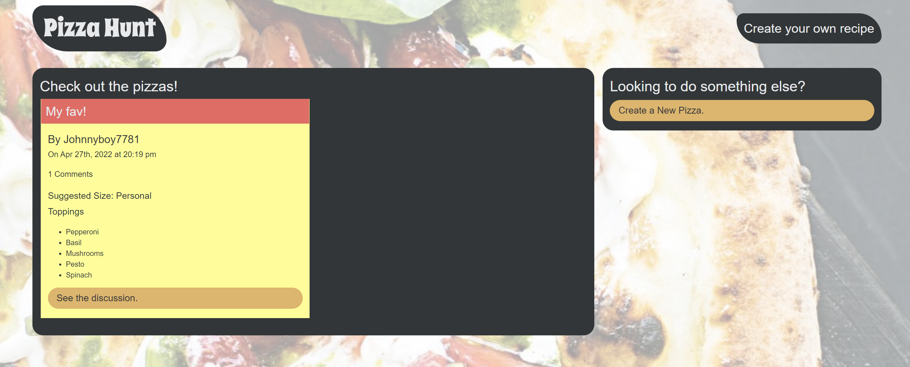

# Pizza Hunt 🍕

## Purpose
A full stack web application for sharing your favorite pizzas! Make posts about pizza and join the discussion today!

## Deployment
View the heroku deployment here: https://salty-brushlands-57607.herokuapp.com/

## Features
 - Make posts about what kind of pizza you like best
 - Comment on posts and reply to comments
 - Use the app even if your internet goes out! All current data is saved locally and submitted when a connect is established

## Built with
* Javascript
* Node
* Heroku
* Express
* MongoDB
* Mongoose
* MongoDB Atlas
* IndexedDB
* HTML
* CSS

## Contribution
Made with ❤️ by Jonathan McDonnell
